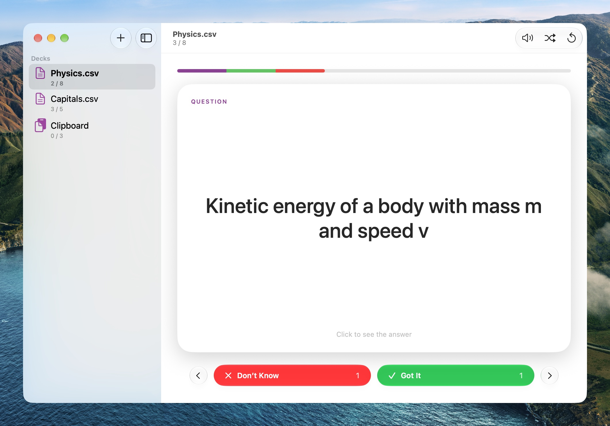
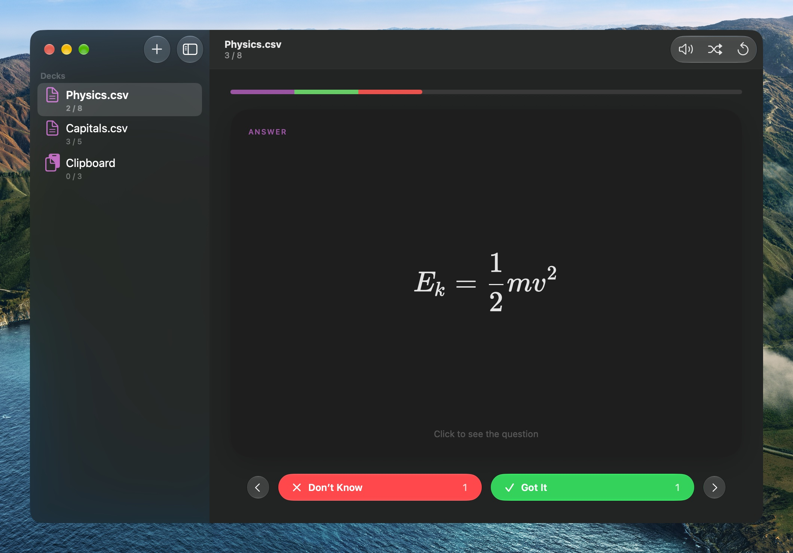
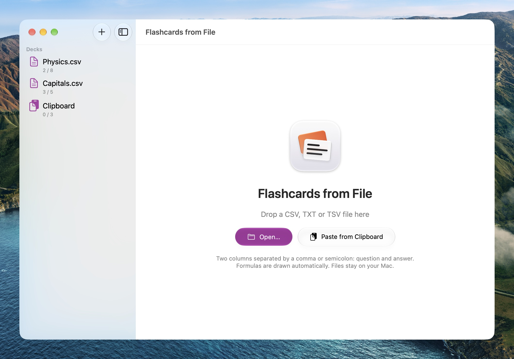
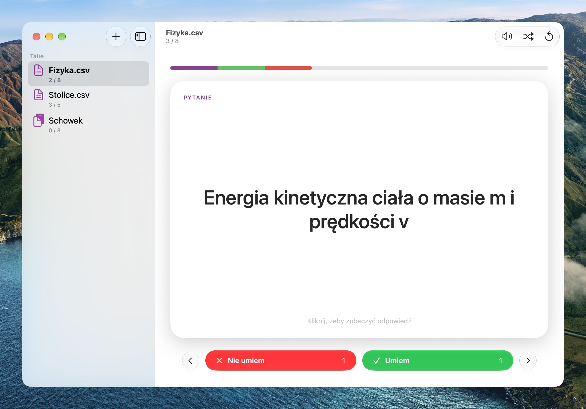
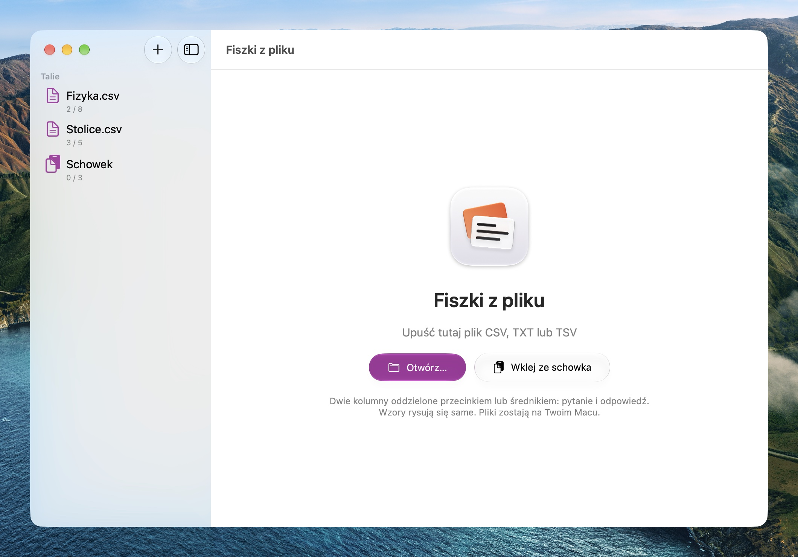
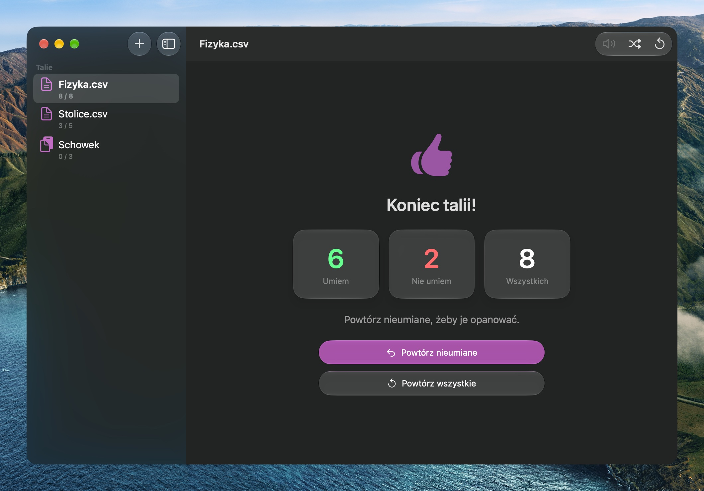

# Flashcards from File

*[Po polsku niżej.](#po-polsku)*

Flashcards for macOS from a plain file: open a CSV, TXT or TSV with two
columns — question and answer — and go through the cards. Click to turn one
over, mark it *Got It* or *Don't Know*, and at the end retry the ones you
missed. Formulas are drawn offline with KaTeX, also when the file has bare
LaTeX without any `$` (NotebookLM exports and the like).

The Mac version of [Fiszki z pliku](https://github.com/EnderNoch/fiszki-z-pliku)
(the web app) and of its Android app. In Finder, the Dock and the menu bar it is
named in the system's language: "Flashcards from File", "Fiszki z pliku",
"Karteikarten aus Datei"…

<p align="center">
  
  
</p>
<p align="center">
  
  
</p>

## Install

1. Download [Flashcards-from-File.zip](https://github.com/EnderNoch/Flashcards-from-File/raw/main/Flashcards-from-File.zip)
   and unzip it (double-click).
2. Drag `Flashcards from File.app` into Applications. Finder and the Dock show
   it under its name in your system's language.
3. First launch: the app is signed ad hoc, not by Apple, so macOS blocks it.
   Open System Settings → Privacy & Security, scroll down, click "Open Anyway"
   next to the app and confirm. After that it opens normally.

Requires macOS 26 or later on a Mac with Apple silicon.

## The file

Two columns: the question, then the answer. The separator is whichever of a
comma, a semicolon or a tab the first line has most of; quotes may wrap a cell
(`""` for a quote inside it), and a header row such as `question;answer` or
`pytanie;odpowiedź` is skipped. UTF-8, or Windows-1250 from old Excel files.

```
question;answer
SI unit of force;newton (N)
Kinetic energy;E_k = \frac{1}{2} m v^2
"A cell; with a semicolon";"An answer with ""quotes"""
```

A file can be opened with ⌘O, dropped on the window or on the Dock icon,
opened from Finder (Open With), or pasted: ⌘V takes text or a file copied in
Finder. Nothing leaves the Mac.

## What it does

- the decks in a sidebar, like notes in Notes; each one keeps its own place and
  ratings, so going back to a deck carries on from the same card. The same
  decks are in File → Open Recent and in the Dock icon's menu
- a card that turns over with a click or Space, slides away when dragged
  sideways, and shows a check or a cross when it has been rated
- *Got It* / *Don't Know* with counters, and a bar over the deck: green known,
  red not, the accent for skipped
- the end of the deck: the counts, Retry Missed and Retry All
- Shuffle and Reset Progress in the toolbar and the Deck menu
- Listen: the side that is showing, read by the system's voice for the card's
  language
- keys as in the web version: Space turns, ← → move, Home / End jump, 1 is
  *Don't Know*, 2 is *Got It*
- formulas: the same detection as the web version (`$…$`, `\(…\)`, `\[…\]`,
  LaTeX commands, `x^2`, `H_2O`, "label: formula"), drawn by KaTeX bundled in
  the app — no internet, no CDN

## Everything from the system

The app has no switches for what the system already provides:

- **language** — the system's language (or this app's language from System
  Settings → General → Language & Region), 43 interface languages;
- **light / dark appearance, font** — as set in System Settings → Appearance,
  the system font;
- **color** — the accent from System Settings → Appearance → Color, at once;
- **glass** — the system's Liquid Glass in the sidebar, toolbar and buttons;
- **icons** — SF Symbols; the app icon is a Liquid Glass icon from Icon
  Composer that follows the icon style (default, dark, clear, tinted);
- **window** — one window like System Settings: closing it quits the app.

No menu bar item and nothing running in the background — it is a window you
open to learn.

## Languages

The app speaks 43 languages and uses your Mac's language, like Apple's own
apps — there is no language setting inside it. Words macOS has for itself
(Open Recent, Clear Menu, Cancel) come from its own localization tables.

Arabic (العربية), Bangla (বাংলা), Belarusian (беларуская), Bulgarian
(български), Catalan (català), Chinese, Simplified (简体中文), Chinese,
Traditional (繁體中文), Croatian (hrvatski), Czech (čeština), Danish (dansk),
Dutch (Nederlands), English, Estonian (eesti), Finnish (suomi), French
(français), German (Deutsch), Greek (Ελληνικά), Hebrew (עברית), Hindi (हिन्दी),
Hungarian (magyar), Icelandic (íslenska), Indonesian (Indonesia), Italian
(italiano), Japanese (日本語), Korean (한국어), Latvian (latviešu), Lithuanian
(lietuvių), Malay (Bahasa Melayu), Norwegian Bokmål (norsk bokmål), Persian
(فارسی), Polish (polski), Portuguese (português), Romanian (română), Russian
(русский), Serbian (српски), Slovak (slovenčina), Slovenian (slovenščina),
Spanish (español), Swedish (svenska), Thai (ไทย), Turkish (Türkçe), Ukrainian
(українська), Vietnamese (Tiếng Việt).

## Built with

| Layer | Technology |
| --- | --- |
| App | Swift + SwiftUI: `Window`, `NavigationSplitView`, state in `@Observable` |
| Glass | the system's Liquid Glass: sidebar, toolbar, `.glass` / `.glassProminent` buttons, `.glassEffect` |
| Formulas | KaTeX 0.19 in an off-screen `WKWebView`, photographed into an image (`takeSnapshot`) — the way the Android app draws them with JLaTeXMath |
| Speech | `AVSpeechSynthesizer`, the language from `NLLanguageRecognizer` |
| Settings | `UserDefaults` (decks with their progress) |
| Icon | `Flashcards.icon` from Icon Composer — the system does the glass and icon styles |
| Build | `build.sh` — `swiftc`, `actool`, `Info.plist`, `codesign --sign -` (ad hoc) |

No Xcode project and no dependencies besides KaTeX, which ships inside the
app — `swiftc` and `actool` (from Xcode, for the icon).

## Files

```
Sources/FlashcardsApp.swift  the app: window, menus, Dock menu, keys, opening files
Sources/Model.swift          decks, progress, the CSV parser, speech
Sources/Views.swift          sidebar, card, buttons, progress bar, end of the deck
Sources/Math.swift           formulas: KaTeX off screen → an image
Sources/Strings.swift        text in 43 languages
Resources/card.html          the page KaTeX lays a card side out in (formula detection)
Resources/katex/             KaTeX (MIT)
Flashcards.icon              the icon from Icon Composer (SVG layers + icon.json)
build.sh                     build, Flashcards-from-File.zip, install into /Applications
screenshots/                 screenshots for this README
```

## Build from source

```sh
./build.sh
```

The script compiles, puts together `Flashcards from File.app`, signs it ad hoc,
packs it into `Flashcards-from-File.zip` and installs it into `/Applications`.

## License

All rights reserved — see [LICENSE](LICENSE). You may download the finished
app and use it on your own computer. This is not open source: copying the
code, distributing it other than by a link to this repository, modifying it
and training AI models on it require the author's written permission.
KaTeX in `Resources/katex` is under its own MIT license.

Made by [EnderNoch](https://github.com/EnderNoch) (Atypical Maker) · part of
[Atypical Maker Mac Apps](https://github.com/EnderNoch/Atypical-Maker-Mac-Apps).

---

## Po polsku

Fiszki na macOS ze zwykłego pliku: otwierasz CSV, TXT albo TSV z dwiema
kolumnami — pytanie i odpowiedź — i przerabiasz karty. Klik odwraca kartę,
oznaczasz *Umiem* albo *Nie umiem*, a na końcu powtarzasz nieumiane. Wzory
rysuje offline KaTeX, także gdy w pliku jest goły LaTeX bez `$` (eksporty
z NotebookLM i podobne).

Wersja na Maca [Fiszek z pliku](https://github.com/EnderNoch/fiszki-z-pliku)
(aplikacji webowej) i ich aplikacji na Androida. W Finderze, Docku i menu
nazywa się w języku systemu: „Fiszki z pliku”, „Flashcards from File”,
„Karteikarten aus Datei”…

<p align="center">
  
  
</p>
<p align="center">
  
  
</p>

### Instalacja

1. Pobierz [Flashcards-from-File.zip](https://github.com/EnderNoch/Flashcards-from-File/raw/main/Flashcards-from-File.zip)
   i rozpakuj go (dwuklik).
2. Przeciągnij `Flashcards from File.app` do folderu Aplikacje. W Finderze
   i Docku pokaże się jako „Fiszki z pliku” (w języku systemu).
3. Pierwsze uruchomienie: aplikacja jest podpisana ad-hoc, nie przez Apple,
   więc macOS ją zablokuje. Otwórz Ustawienia → Prywatność i ochrona, przewiń
   w dół i kliknij „Otwórz mimo to” przy aplikacji, potem potwierdź. Później
   otwiera się już normalnie.

Wymaga macOS 26 lub nowszego i Maca z procesorem Apple.

### Plik

Dwie kolumny: pytanie, potem odpowiedź. Separator to ten z przecinka,
średnika i tabulatora, którego w pierwszym wierszu jest najwięcej; komórkę
można wziąć w cudzysłów (`""` to cudzysłów w środku), a wiersz nagłówka
w rodzaju `pytanie;odpowiedź` albo `question;answer` jest pomijany. UTF-8 albo
Windows-1250 ze starego Excela.

```
pytanie;odpowiedź
Jednostka siły w układzie SI;niuton (N)
Energia kinetyczna;E_k = \frac{1}{2} m v^2
"Komórka; ze średnikiem";"Odpowiedź z ""cudzysłowem"""
```

Plik otwiera się przez ⌘O, upuszczenie na okno albo na ikonę w Docku, z
Findera (Otwórz za pomocą) albo wklejeniem: ⌘V bierze tekst albo plik
skopiowany w Finderze. Nic nie wychodzi poza Maca.

### Co potrafi

- talie w pasku bocznym, jak notatki w Notatkach; każda pamięta swoje miejsce
  i oceny, więc powrót do talii zaczyna od tej samej karty. Te same talie są
  w Plik → Otwórz ostatnie i w menu ikony w Docku
- karta, która obraca się kliknięciem albo spacją, odjeżdża przeciągnięta
  w bok i pokazuje ptaszek albo krzyżyk, gdy już ma ocenę
- *Umiem* / *Nie umiem* z licznikami i pasek nad talią: zielone umiane,
  czerwone nieumiane, akcent dla pominiętych
- koniec talii: liczby, Powtórz nieumiane i Powtórz wszystkie
- Losuj i Resetuj postęp na pasku narzędzi i w menu Talia
- Odsłuchaj: widoczna strona czytana głosem systemu w języku karty
- klawisze jak w wersji webowej: spacja odwraca, ← → przewijają, Home / End
  skaczą, 1 to *Nie umiem*, 2 to *Umiem*
- wzory: to samo wykrywanie co w wersji webowej (`$…$`, `\(…\)`, `\[…\]`,
  komendy LaTeX, `x^2`, `H_2O`, „etykieta: wzór”), rysowane przez KaTeX
  wbudowany w aplikację — bez internetu i bez CDN

### Wszystko z systemu

Aplikacja nie ma przełączników, które system już daje:

- **język** — język systemu (albo język tej aplikacji z Ustawień → Ogólne →
  Język i region), 43 języki interfejsu;
- **jasny / ciemny wygląd, czcionka** — jak w Ustawieniach → Wygląd, czcionka
  systemu;
- **kolor** — akcent z Ustawień → Wygląd → Kolor, od razu;
- **szkło** — systemowe Liquid Glass w pasku bocznym, pasku narzędzi
  i przyciskach;
- **ikony** — SF Symbols; ikona aplikacji to ikona Liquid Glass z Icon
  Composera, która idzie za stylem ikon (domyślny, ciemny, przejrzysty,
  zabarwiony);
- **okno** — jedno, jak Ustawienia systemowe: zamknięcie okna zamyka aplikację.

Bez ikony na pasku menu i bez działania w tle — to okno, które otwiera się do
nauki.

### Języki

Aplikacja mówi w 43 językach i używa języka Maca, jak aplikacje Apple — nie ma
w niej wyboru języka. Słowa, które macOS ma u siebie (Otwórz ostatnie, Wyczyść
menu, Anuluj), są wzięte z jego tabel tłumaczeń.

angielski, arabski, bengalski, białoruski, bułgarski, chiński tradycyjny,
chiński uproszczony, chorwacki, czeski, duński, estoński, fiński, francuski,
grecki, hebrajski, hindi, hiszpański, indonezyjski, islandzki, japoński,
kataloński, koreański, litewski, łotewski, malajski, niderlandzki, niemiecki,
norweski (bokmål), perski, polski, portugalski, rosyjski, rumuński, serbski,
słowacki, słoweński, szwedzki, tajski, turecki, ukraiński, węgierski,
wietnamski, włoski.

### W czym to jest zrobione

| Warstwa | Technologia |
| --- | --- |
| Aplikacja | Swift + SwiftUI: `Window`, `NavigationSplitView`, stan w `@Observable` |
| Szkło | systemowe Liquid Glass: pasek boczny, pasek narzędzi, przyciski `.glass` / `.glassProminent`, `.glassEffect` |
| Wzory | KaTeX 0.19 w niewidocznym `WKWebView`, fotografowany do obrazka (`takeSnapshot`) — tak jak aplikacja na Androida rysuje je JLaTeXMath |
| Mowa | `AVSpeechSynthesizer`, język z `NLLanguageRecognizer` |
| Pamięć ustawień | `UserDefaults` (talie razem z postępem) |
| Ikona | `Flashcards.icon` z Icon Composera — szkło i style ikon robi system |
| Budowanie | `build.sh` — `swiftc`, `actool`, `Info.plist`, `codesign --sign -` (ad-hoc) |

Bez projektu Xcode i bez zależności poza KaTeX, który jest w środku
aplikacji — `swiftc` i `actool` (ten z Xcode, do ikony).

### Pliki

```
Sources/FlashcardsApp.swift  aplikacja: okno, menu, menu Docka, klawisze, otwieranie plików
Sources/Model.swift          talie, postęp, parser CSV, mowa
Sources/Views.swift          pasek boczny, karta, przyciski, pasek postępu, koniec talii
Sources/Math.swift           wzory: KaTeX poza ekranem → obrazek
Sources/Strings.swift        teksty w 43 językach
Resources/card.html          strona, na której KaTeX układa stronę karty (wykrywanie wzorów)
Resources/katex/             KaTeX (MIT)
Flashcards.icon              ikona z Icon Composera (warstwy SVG + icon.json)
build.sh                     budowanie, Flashcards-from-File.zip i instalacja w /Applications
screenshots/                 zrzuty ekranu do README
```

### Budowanie ze źródeł

```sh
./build.sh
```

Skrypt kompiluje, składa pakiet `Flashcards from File.app`, podpisuje go
ad-hoc, pakuje do `Flashcards-from-File.zip` i instaluje w `/Applications`.

### Licencja

Wszelkie prawa zastrzeżone — patrz [LICENSE](LICENSE). Gotową aplikację wolno
pobrać i używać na własnym komputerze. To nie jest oprogramowanie otwarte:
kopiowanie kodu, rozpowszechnianie inaczej niż linkiem do tego repozytorium,
zmiany i trenowanie na nim modeli AI wymagają pisemnej zgody autora. KaTeX
w `Resources/katex` ma własną licencję MIT.

Autor: [EnderNoch](https://github.com/EnderNoch) (Atypical Maker).
